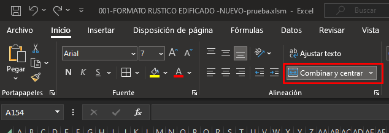

# Filas en Excel

## Índice

- [Filas en Excel](#filas-en-excel)
  - [Índice](#índice)
  - [Agregar más filas a una tabla](#agregar-más-filas-a-una-tabla)
    - [Insertar una nueva fila](#insertar-una-nueva-fila)
      - [Asignar formato a a nueva fila](#asignar-formato-a-a-nueva-fila)
    - [Insertar más de una fila](#insertar-más-de-una-fila)
      - [Asignar formato al nuevo rango de filas](#asignar-formato-al-nuevo-rango-de-filas)
  - [Copiar contenido de celdas combinadas](#copiar-contenido-de-celdas-combinadas)

## Agregar más filas a una tabla

Para agregar una fila a una tabla con un formato complejo debe considerarse lo siguiente:

### Insertar una nueva fila

1. Seleccionar la fila completa en la que, encima, se agregará la nueva fila.

   > **IMPORTANTE**: Es indispensable que la celda seleccionada sea de la parte central de la tabla (NO la del principio, NO la del final) para que se facilite la aplicación del formato.
2. Hacemos clic derecho en el indicador de la fila ( en el ejemplo se selecciona la fila `99`).
3. Hacer clic en *insertar*.
4. Se mostrará ahora la fila `99` como vacía y en cambio la celda `100` mostrará los valores, es decir, se habrá recorrido la información hacia abajo.

#### Asignar formato a a nueva fila

1. Se Selecciona el indicador de la fila con formato de origen, para este ejemplo la celda `100`.
2. Se hace clic en el ícono de copiar formato: .
3. Ahora se selecciona el indicador de fila de destino, para el ejemplo `99`.
4. Se mostrará la fila con un formato adecuado para la tabla.

> **IMPORTANTE**: si alguna de las columnas de la tabla contiene una fórmula, hay que arrastrarla para que se aplique a la nueva fila insertada.

### Insertar más de una fila

1. Seleccionar las filas completas en la que, encima, se agregará el nuevo rango de filas.

   > **IMPORTANTE**: Puesto que a la fecha, Excel no tiene modo de agregar un número de filas de manera amigable, se agregarán tantas filas como las que sean seleccionadas.
   > **IMPORTANTE**: Es indispensable que la celda seleccionada sea de la parte central de la tabla (NO la del principio, NO la del final) para que se facilite la aplicación del formato.

2. Hacemos clic derecho en el indicador de las fila (en el ejemplo se selecciona la fila `98-101` (*4 filas*)).
3. Hacer clic en *insertar*.
4. Se mostrarán ahora las 4 filas `98-101` como vacías y en cambio la celdas `102-105` mostrarán los valores, es decir, se habrá recorrido la información hacia abajo.

#### Asignar formato al nuevo rango de filas

1. Se Selecciona el indicador de la fila con formato de origen, para este ejemplo la celda `102`.
2. Se hace clic en el ícono de copiar formato: .
3. Ahora se seleccionan los indicador de filas de destino, para el ejemplo `98-101`.
4. Se mostrarán las filas con un formato adecuado para la tabla.

> **IMPORTANTE**: si alguna de las columnas de la tabla contiene una fórmula, hay que arrastrarla para que se aplique a las nuevas filas insertadas.

## Copiar contenido de celdas combinadas

Para copiar contenido de una tabla a otra, hay que seguir los siguientes pasos:

1. [Agregar las filas](#insertar-una-nueva-fila) necesarias hasta tener las mismas que la tabla de origen.

   > **IMPORTANTE**: Se deben agregar las filas necesarias hasta tener las mismas que la tabla de origen de datos. Para este ejemplo, la tabla de origen consta de `6` filas y la de destino con `3`, por lo que hay que agregar el resto.

2. [Aplicar el formato](#asignar-formato-al-nuevo-rango-de-filas) a las nuevas filas ingresadas para completar la tabla.
3. Puesto que no se puede pegar un contenido copiado hacia celdas combinadas, se deben descombinar haciendo clic en:
   
4. Se copia el contenido de la tabla de origen y se pega en la primera celda descombinada de la tabla destino (usando el pegado especial como se muestra en la animación). Esto provocará que se llenen las demás celdas de manera vertical. (Si aparecen mensajes de advertencia, aceptarlos).
5. De la primera fila copiada en la tabla de destino, seleccionar las celdas que se desagruparon y agruparlas nuevamente con el botón del paso 3.
6. Finalmente copiar el formato de esta celda combinada y pegarlo en las celdas inferiores para completar el formato con: .

