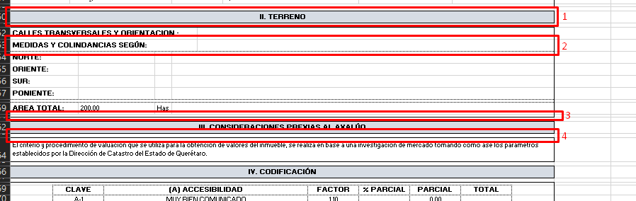
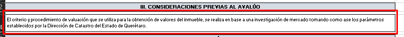
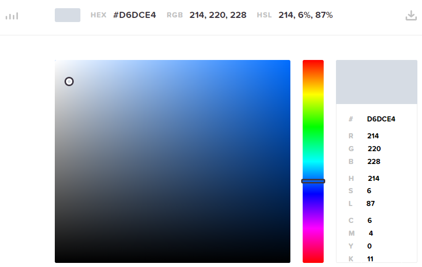
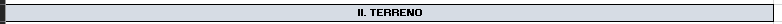
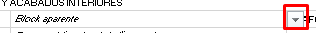
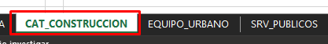
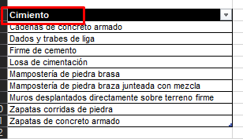
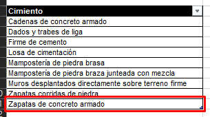
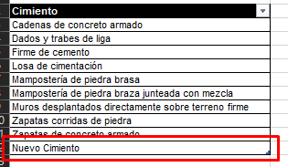
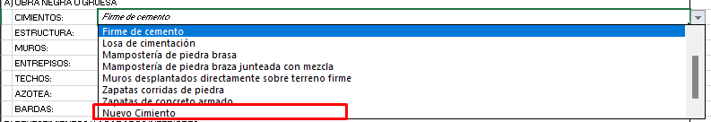

# Especificación de Documentos

## Índice

- [Especificación de Documentos](#especificación-de-documentos)
  - [Índice](#índice)
  - [Revisiones](#revisiones)
  - [Introducción](#introducción)
  - [Entregables](#entregables)
  - [Formato de los documentos](#formato-de-los-documentos)
    - [Alto de filas](#alto-de-filas)
    - [Ancho de columnas](#ancho-de-columnas)
    - [Colores de fondo y líneas de contorno](#colores-de-fondo-y-líneas-de-contorno)
      - [Títulos](#títulos)
      - [Cuerpo de la sección](#cuerpo-de-la-sección)
  - [Llenado de las secciones](#llenado-de-las-secciones)
    - [Texto Abierto](#texto-abierto)
    - [Listas desplegables](#listas-desplegables)
    - [Calculados](#calculados)
  - [Anexos](#anexos)
    - [Agregar opciones a una lista desplegable](#agregar-opciones-a-una-lista-desplegable)
      - [Procedimiento](#procedimiento)

## Revisiones

|Fecha|Nombre|Cambio|
|-|-|-|
|03/11/2022|Eduardo Almaraz Pintor|Se crea el documento de especificaciones|

## Introducción

El presente documento muestra los parámetros tomados en cuenta para la generación de los documentos solicitados para el presente proyecto.

## Entregables

|No.|Tipo|Nombre del entregable|Descripción|
|-|-|-|-|
|1|Excel (Habilitado para Macros)|`1_urbano_edificado.xlsm`|Avalúo Hacendario para propiedades urbanas edificadas.|
|2|Excel (Habilitado para Macros)|`2_urbano_no_edificado.xlsm`|Avalúo Hacendario para propiedades urbanas no edificadas.|
|3|Excel (Habilitado para Macros)|`3_rustico_edificado.xlsm`|Avalúo Hacendario para propiedades rústicas edificadas|
|4|Excel (Habilitado para Macros)|`4_rustico_no_edificado.xlsm`|Avalúo Hacendario para propiedades rústicas no edificadas.|
|5|Visual Basic for Applications|`numero.bas`|Script para el cálculo del texto dado un número en Excel.|

## Formato de los documentos

Para guardar la uniformidad de los archivos, se establecieron los los siguientes parámetros para cada sección de trascendencia:

- **Estilo de fuente**: `Arial`
- **Tamaño de fuente**: variable dependiendo del contexto.

### Alto de filas

1. Para los títulos se establece una altura de `12.75` que es suficiente para albergar el texto.
2. Los renglones estandar (campos de llenado), tienen una altura de `12.75` que es suficiente para albergar el texto.

    >**Es importante mencionar que para mantener las proporciones adecuadas, en los campos que tienen a crecer (Aquellos que describen alguna característica, citas, dispociciones de ley, etc.) hay que multiplicar el número de líneas resultantes por este número**.

    Ejemplo:

    

    En este caso la altura sería calculada por $h=12.75*2, h=25.5$.
3. Cada sección cuenta con una fila que brinda separación éxtra y marca el final de la misma de `3`.
4. Antes y después de los títulos, se extablece un espacio para darle realce al mismo de `5`.

### Ancho de columnas

Para mejorar la apariencia de las tablas que se optó por la conformación de una malla de 64 columnas de un ancho de `1`, es decir, de mantuvo un formato de resolución binaria ( $2^6=64$ columnas) con la finalidad de reducir los espacios, flexibilizar el centrado y formato de las tablas, mejorar la visibilidad al momento de combinar celdas, etc.

En este sentido, se toma el rango para el área de impresión desde `A` hasta `BL` (`A:BL`), mismo que se considera suficiente como área de trabajo.

El formato tiene una escalabilidad vertical, lo que permite el agregado de más secciones o filas unitarias manteniendo esta área de impresión, por lo que se recomienda **SIEMPRE AGREGAR CUALQUIER ITEM EN LA PARTE INFERIOR**. Al seguir esta recomendación, se evitarán errores de dedo al establecer nuevas áreas.

### Colores de fondo y líneas de contorno

#### Títulos

Los títulos son enmarcados con una línea sólida de color negro de 1 pts. Además, se sombrea con un color neutro HEX(#D6DCE4).

Ejemplo:

#### Cuerpo de la sección

El cuerpo de cada sección y en general del documento, carecen de color de fondo. La razón para mantenerlo así es simple: _**Identidicar de una forma más clara los espacios de llenado del documento**_. El colorear el fondo (de blanco, por ejemplo), evita identificar los bordes de las celdas, que, al final del día, no se imprimen en el papel.

En cuanto al borde, se mantiene sólido negro de 1 pts para todo el contorno, ecluyendo los contornos interiores.

Para el caso de las tablas, se aplica línea punteada color negro de 1 pts, aplicando el mismo color de fondo a los encabezados que en los [títulos](#títulos).

## Llenado de las secciones

### Texto Abierto

La mayoría de los campos en los documentos son textos abiertos y que tienen que ver con la información personal o geográfica. En este caso se deberán llenar de manera manual lo correspondiente a cada caso de estudio.

### Listas desplegables

Para el caso de las listas desplegables, el campo mostrará un ícono que, al hacer clic, se desplegarán los valores posibles. Esto con la finalidad de evitar en lo posible los errores de dedo.

Estas listas pueden crecer en opciones de acuerdo a la necesidad del usuario. Para agregar opciones al catálogo, vea el anexo [Agregar opciones a una lista desplegable](#agregar-opciones-a-una-lista-desplegable).

### Calculados

Los campos calculados corresponden a celdas que hacen referencia a una fórmula, función de Excel o función de usuario.

## Anexos

### Agregar opciones a una lista desplegable

Las listas desplegables de Excel se componen de dos componentes principales:

1. _Componente de selección_: Es el ícono _clickeable_ que se muestra en una celda configurada para lista desplegable.

    

2. _Origen de datos (Datasource)_: Como el nombre lo indica, es el lugar de donde se obtienen las opciones de la lista. Este origen puede ser incrementado o decrementado según sea el caso.

Cada documento tiene catálogos para las listas desplegables indicado en las hojas `CAT_UTIL`, `CAT_ZONA` y `CAT_CONSTRUCCION`. En algunos documentos por las características no son utilizados, aunque pueden hacer uso de ellos en cualquier momento.

- Catálogo Utilería: Contiene las listas que pidieran ser útiles para llenar el formato. Por ahora sólo tiene `Unidades de Medida`.
- Catálogo de Zona: Contiene las listas relacionadas a la zona.
  - `Clasificación de la zona`
  - `Construcción dominante en la calle`
  - `Índice de saturación`
  - `Tipo de construcción`
  - `Población`
  - `Vías de acceso e importancia de las mismas`
  - `Servicios públicos y equipamiento urbano`
  - `Agua potable`
  - `Drenaje y alcantarillado`
  - `Red de electrificación`
  - `Alumbrado público`
  - `Parámetro de las vialidades`
  - `Banquetas`
  - `Vialidades`
  - `Pavimentos`
  - `Mat. En camellones`
  - `Líneas telefónicas`
  - `Transporte`
  - `Otros servicios o equipamentos`

- Catálogo de Construcción: Contiene las listas relacionadas a las construcciones.
  - `Cimiento`
  - `Estructura`
  - `Muro`
  - `Entrepiso`
  - `Techo`
  - `Azotea`
  - `Barda`
  - `Zoclo`
  - `Escalera`
  - `Aplanado`
  - `Piso`
  - `Pintura`
  - `Recubrimiento`
  - `Carpintería`
  - `Instalaciones sanitarias`
  - `Muebles de Baño`
  - `Instalaciones Hidráulicas`
  - `Instalaciones Eléctricas`
  - `Herrería`
  - `Cerrajería`
  - `Vidriería`
  - `Fachada`
  - `Lambrin`

#### Procedimiento

Para agregar un nuevo item a cualquiera de las listas, siga los siguientes pasos:

1. Seleccionar la hoja de Excel donde se encuentra el catálogo al que se le desea agregar un item.

   
2. Ubicar la lista por título.

   
3. Seleccionar el último registro y hacer **Intro**.

   
4. Escribir el nuevo elemento y hacer **Intro**.

   
5. Verificar que en la lista desplegable se muestre la nueva entrada.

   
6. Fin del procedimiento.
